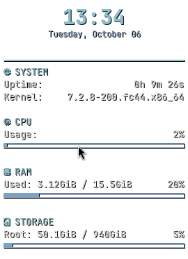
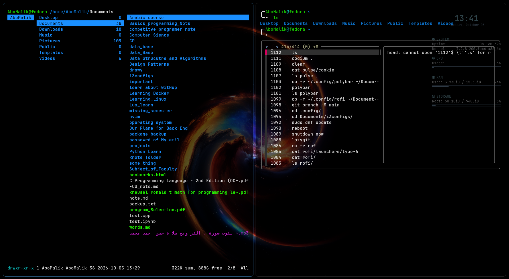

# 🛠️ My i3wm Configuration

#### My personal configuration files for the **i3 window manager** (i3wm), optimized for productivity, speed, and a clean workflow.


### General over view 
<video controls src="video_with_sound_effects.mkv" title="Title"></video>

### conky 


### kitty and zsh and ranger(in left)


### picom 


### polybar 


### default bar 


## 🔧 Installation
```bash
git clone [https://github.com/Abd-El-Qader/i3config.git](https://github.com/Abd-El-Qader/i3config.git) ~/.config/i3